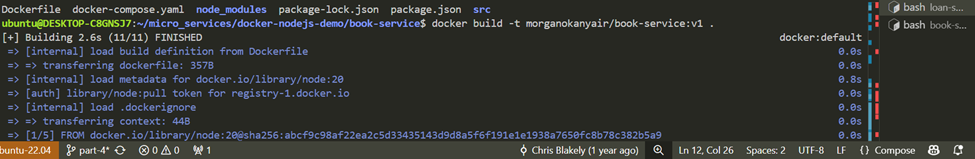
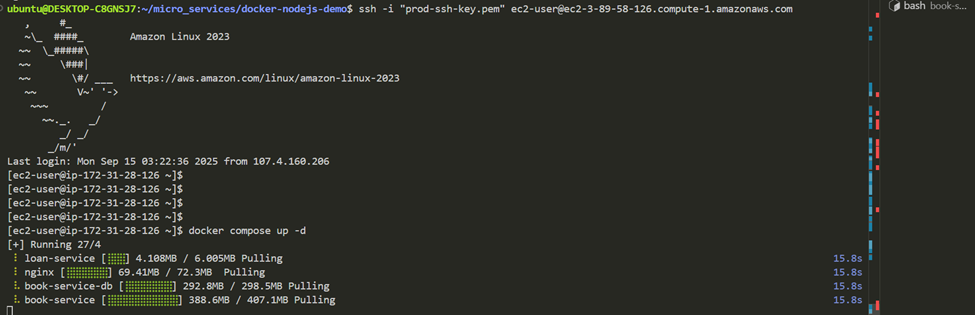

# mokanyair-Docker-Microservices-Project
A production-ready microservices project built with Node.js, MongoDB, and Docker Compose, demonstrating containerization, orchestration, and deployment on AWS EC2 using Docker Hub for image distribution.

Project Description:
This repository hosts a production-style Dockerized microservices application built using Node.js, Express, Nginx and MongoDB.
It demonstrates real-world containerization, orchestration, and cloud deployment, with multiple services independently packaged and managed via Docker Compose.
The project showcases end-to-end development and deployment workflow: building images, publishing them to Docker Hub, and deploying a fully functional microservices application stack on AWS EC2.

Architecture Diagram
This architecture is a containerized microservices application deployed on an AWS EC2 instance.

Nginx routes requests between the book-service and loan-service.

book-service connects to MongoDB, which stores data persistently on an EBS-backed volume.

Deployment and scaling are managed with Docker Compose on the EC2 instance, providing a production-ready setup while leveraging AWS infrastructure.

Setup and Run Instructions:
Clone the repository:
https://github.com/mokanyair/mokanyair-Docker-Microservices-Project.git
cd mokanyair-Docker-Microservices-Project
run --> npm install && npm start : This installs all the project dependencies
run --> docker login : Logs into Docker Hub account.
run --> docker build -t morganokanyair/book-service:v1 . : This command builds a Docker image from the current directory and tags it as morganokanyair/book-service:v1, morganokanyair is a Docker Hub username.

Do thesame for loan-service:

run --> docker push morganokanyair/book-service:v1 : Means, take the image named book-service (tagged as v1) that is built locally, and upload it to the Docker Hub account morganokanyair

Do thesame for loan-service

Create an EC2 instance, login and perform a secured copy of the nginx.cof and the docker-compose.yaml file to the my current working directory.

Log in and run --> docker compose up -d : While deploying the containers, the docker.compose.yaml references the docker file for each of the seervices.

If successful, the output below will be seen:

run --> docker container ls : This lists the running container that has been deployed.

Confirm functionality by calling the book-service and loan-service api through nginx using the EC2 public ip.

